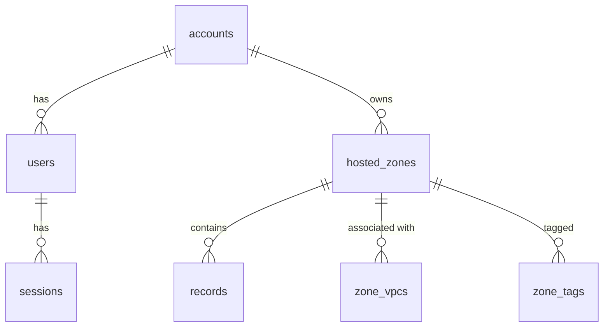

# AWS Route 53 Clone

A working clone of the **Amazon Route 53 console** — hosted zones and DNS records with full CRUD,
built with **Next.js (TypeScript)**, **FastAPI** and **SQLite**.

The UI is built on [Cloudscape](https://cloudscape.design), the open-source design system that the AWS
Management Console itself uses, so tables, forms, modals, flash notifications, split panels and the
side navigation look and behave like the real console rather than an approximation of it.

- **Live demo:** _see the link in the repository description_
- **Demo login:** account `123456789012` (or alias `demo`) · IAM user `admin` · password `Route53Demo!`

---

## Features

| Area | What works |
| --- | --- |
| **Auth (mocked)** | AWS-style IAM sign-in page, login / logout, session persistence via an httpOnly cookie backed by a `sessions` table, auth guard on every console route, "Remember this account". |
| **Hosted zones** | List with property filter (name / type / description / ID + free text), sorting, server-side pagination, column preferences, page size, striped rows. Create (public or private + VPC associations + tags), view details, edit (description, VPCs, tags — name and type are immutable, as in Route 53), delete with a type-`delete`-to-confirm modal. Route 53 refuses to delete a zone that still has records other than the default NS/SOA, and so does this clone. |
| **DNS records** | A, AAAA, CNAME, TXT, MX, NS, PTR, SRV, CAA (plus SPF, DS, NAPTR). Quick-create several records in one atomic change batch, edit in the split panel, single and bulk delete. Text search + Type / Routing policy / Alias filters, sorting, pagination. Routing policies: simple, weighted, latency, failover, geolocation, multivalue. Alias records (ELB, CloudFront, S3, API Gateway, another record in the zone…). |
| **Route 53 behaviour** | New zones get 4 `awsdns` name servers + an SOA record automatically; default NS/SOA can be edited but not deleted; CNAME not allowed at the apex or alongside other records; duplicate record sets rejected; Route 53-style error messages (`ARRDATAIllegalIPv4Address`, …). |
| **Console UX** | Top navigation, collapsible Route 53 side nav, breadcrumbs, "Info" links that open the help panel, flash notifications that survive navigation, record details split panel, Test record tool, Dashboard with live counts. Health checks, Traffic policies, Resolver, Profiles, Domains, DNS Firewall are "Coming soon" placeholders. |
| **Bonus** | ✅ BIND zone-file import (paste or upload) · ✅ export as BIND or JSON · ✅ dark mode (+ compact density) · ✅ keyboard shortcuts · ✅ bulk record delete |

### Keyboard shortcuts

| Keys | Action |
| --- | --- |
| `/` | Focus the filter box |
| `c` | Create hosted zone / record (on list pages) |
| `r` | Refresh the table |
| `i` | Import zone file (inside a hosted zone) |
| `g` then `h` / `g` then `d` | Go to Hosted zones / Dashboard |
| `t` | Toggle dark mode |
| `?` | Show all shortcuts |

---

## Setup

Prerequisites: **Python 3.11+** and **Node.js 20+**.

### 1. Backend (FastAPI) — http://localhost:8000

```bash
cd backend
python -m venv .venv
# Windows: .venv\Scripts\activate    macOS/Linux: source .venv/bin/activate
pip install -r requirements.txt
uvicorn app.main:app --reload --port 8000
```

On first start the database (`backend/route53.db`) is created and seeded with the demo account and four
sample hosted zones (`example.com` with 35 records covering every type and routing policy, `acme-shop.io`,
the private zone `internal.corp`, and the reverse zone `1.168.192.in-addr.arpa`).
Interactive API docs: http://localhost:8000/docs

Run the test suite (50 tests):

```bash
python -m pytest -q
```

### 2. Frontend (Next.js) — http://localhost:3000

```bash
cd frontend
npm install
npm run dev
```

Open http://localhost:3000 and sign in with the demo credentials.

### Environment variables

| Variable | Where | Default | Purpose |
| --- | --- | --- | --- |
| `BACKEND_URL` | frontend | `http://127.0.0.1:8000` | Where Next.js proxies `/api/*` |
| `DATABASE_URL` | backend | `sqlite:///./route53.db` | SQLite file location |
| `COOKIE_SECURE` | backend | `0` | Set `1` in production (HTTPS-only cookie) |
| `CORS_ORIGINS` | backend | `http://localhost:3000` | Only needed if the browser calls the API directly |
| `SEED_DEMO` | backend | `1` | Seed demo data into an empty database |

---

## Architecture

```
 Browser ──────────────► Next.js (Vercel)                     FastAPI (Render)              SQLite
   │  /route53/v2/...      App Router, client components        routers/  auth · hosted_zones   route53.db
   │                       Cloudscape design system             │         records · dashboard
   └─ fetch('/api/*') ──►  next.config rewrites /api/* ───────► services/ dns (domain logic)
      same-origin,         to BACKEND_URL                       │         validation · bind
      httpOnly cookie                                           models (SQLAlchemy 2) ─────────► tables
```

- **Same-origin API.** The browser only ever calls `/api/*` on the frontend's own origin and Next.js
  rewrites it to FastAPI. The session cookie is therefore first-party (no third-party cookie or CORS
  problems between Vercel and Render), and the frontend has a single `api.ts` client with typed methods.
- **Backend layering.** Routers are thin (parse query/body, call a service, shape the response).
  `services/dns.py` holds the zone and record rules shared by the API, the BIND importer and the seed;
  `services/validation.py` holds per-type RDATA validation with Route 53-style messages;
  `services/bind.py` parses and renders zone files. Errors are raised as a typed `ApiError` and rendered
  as `{"detail": {"code", "message"}}` by one exception handler.
- **Frontend structure.**
  - `app/route53/v2/layout.tsx` is the authenticated console shell (session guard, top nav, global shortcuts).
  - `components/shell/ConsolePage.tsx` wraps Cloudscape `AppLayout`: side nav, breadcrumbs, flashbar,
    help panel (opened by any `InfoLink`) and the optional split panel.
  - Providers: `AuthProvider` (session), `ThemeProvider` (dark mode / density, persisted),
    `NotificationsProvider` (flash messages that persist across client-side navigation).
  - Record forms share one `RecordFields` component (create page and split-panel edit) driven by a
    `RecordDraft` model in `lib/recordDraft.ts`; `lib/validation.ts` mirrors the server rules for instant
    field errors, and the API stays the source of truth.
  - Tables use server-side search, filtering, sorting and pagination; user table preferences are kept in
    `localStorage`.

```
route53-clone/
├── backend/
│   ├── app/
│   │   ├── main.py            # app factory, CORS, error handlers, startup seed
│   │   ├── config.py · database.py · models.py · schemas.py · auth.py · errors.py · seed.py
│   │   ├── routers/           # auth, hosted_zones, records, dashboard
│   │   └── services/          # dns.py, validation.py, bind.py, ids.py
│   ├── tests/                 # pytest + TestClient (50 tests)
│   └── requirements.txt
├── frontend/
│   └── src/
│       ├── app/               # signin, route53/v2/{dashboard, hostedzones, [zoneId], …}
│       ├── components/        # shell, providers, zones, records, common
│       └── lib/               # api client, types, record metadata, validation, hooks
└── render.yaml                # Render blueprint for the backend
```

---

## Database schema

SQLite with foreign keys enforced (`PRAGMA foreign_keys=ON`) and WAL mode. Deleting a hosted zone
cascades to its records, VPC associations and tags.



```sql
CREATE TABLE accounts (
  id          VARCHAR(12) PRIMARY KEY,            -- 12-digit AWS account id
  alias       VARCHAR(63) UNIQUE,
  created_at  DATETIME NOT NULL
);
CREATE TABLE users (
  id            INTEGER PRIMARY KEY,
  account_id    VARCHAR(12) NOT NULL REFERENCES accounts(id) ON DELETE CASCADE,
  username      VARCHAR(64) NOT NULL,
  display_name  VARCHAR(128) NOT NULL,
  password_hash VARCHAR(256) NOT NULL,            -- PBKDF2-SHA256 with per-user salt
  created_at    DATETIME NOT NULL,
  UNIQUE (account_id, username)
);
CREATE TABLE sessions (
  token       VARCHAR(64) PRIMARY KEY,            -- random opaque token, stored in an httpOnly cookie
  user_id     INTEGER NOT NULL REFERENCES users(id) ON DELETE CASCADE,
  created_at  DATETIME NOT NULL,
  expires_at  DATETIME NOT NULL                   -- 7 days
);
CREATE TABLE hosted_zones (
  id                VARCHAR(32) PRIMARY KEY,      -- "Z" + 20 chars, like real Route 53 ids
  account_id        VARCHAR(12) NOT NULL REFERENCES accounts(id) ON DELETE CASCADE,
  name              VARCHAR(255) NOT NULL,        -- FQDN with trailing dot
  type              VARCHAR(10) NOT NULL CHECK (type IN ('public','private')),
  comment           TEXT NOT NULL,
  caller_reference  VARCHAR(128) NOT NULL,
  created_at        DATETIME NOT NULL,
  updated_at        DATETIME NOT NULL
);
-- Public zone names are unique per account; private zones may share a name (as in Route 53).
CREATE UNIQUE INDEX uq_public_zone_name ON hosted_zones (account_id, name) WHERE type = 'public';
CREATE INDEX ix_zone_account_name ON hosted_zones (account_id, name);

CREATE TABLE zone_vpcs (
  id       INTEGER PRIMARY KEY,
  zone_id  VARCHAR(32) NOT NULL REFERENCES hosted_zones(id) ON DELETE CASCADE,
  region   VARCHAR(32) NOT NULL,
  vpc_id   VARCHAR(32) NOT NULL,
  UNIQUE (zone_id, region, vpc_id)
);
CREATE TABLE zone_tags (
  id       INTEGER PRIMARY KEY,
  zone_id  VARCHAR(32) NOT NULL REFERENCES hosted_zones(id) ON DELETE CASCADE,
  "key"    VARCHAR(128) NOT NULL,
  value    VARCHAR(256) NOT NULL,
  UNIQUE (zone_id, "key")
);
CREATE TABLE records (
  id                            INTEGER PRIMARY KEY,
  zone_id                       VARCHAR(32) NOT NULL REFERENCES hosted_zones(id) ON DELETE CASCADE,
  name                          VARCHAR(255) NOT NULL,   -- FQDN, lower-case, trailing dot
  type                          VARCHAR(10) NOT NULL,
  ttl                           INTEGER,                 -- NULL for alias records
  "values"                      TEXT NOT NULL,           -- JSON array of RDATA strings
  routing_policy                VARCHAR(16) NOT NULL CHECK (routing_policy IN
                                  ('simple','weighted','latency','failover','geolocation','multivalue')),
  set_identifier                VARCHAR(128),            -- "Record ID" for non-simple policies
  weight                        INTEGER,
  region                        VARCHAR(32),
  failover                      VARCHAR(10),
  geo_location                  VARCHAR(64),
  health_check_id               VARCHAR(64),
  alias                         BOOLEAN NOT NULL,
  alias_dns_name                VARCHAR(255),
  alias_hosted_zone_id          VARCHAR(32),
  alias_evaluate_target_health  BOOLEAN NOT NULL,
  is_default                    BOOLEAN NOT NULL,        -- the zone's own NS/SOA: editable, not deletable
  created_at                    DATETIME NOT NULL,
  updated_at                    DATETIME NOT NULL
);
CREATE INDEX ix_record_zone_name_type ON records (zone_id, name, type);
```

**Design notes.** A record row is a Route 53 *resource record set* (name + type + set identifier) and
its values are stored together as a JSON array, because they are always read and written as one unit.
Uniqueness of `(zone, name, type, set_identifier)` is enforced in the service layer so the API can
return Route 53's `RecordAlreadyExists` error instead of a raw constraint failure. `record_count` is
computed with a `COUNT` join rather than stored, so it can never drift.

---

## API overview

All endpoints live under `/api`, take and return JSON, and (except login and health) require the session
cookie. Errors use one shape: `{"detail": {"code": "InvalidChangeBatch", "message": "…"}}`.
Full interactive docs: `/docs` (Swagger UI).

| Method | Path | Description |
| --- | --- | --- |
| `POST` | `/api/auth/login` | `{account, username, password}` → user, sets `r53_session` cookie |
| `POST` | `/api/auth/logout` | Ends the session (204) |
| `GET` | `/api/auth/me` | Current user, or 401 |
| `GET` | `/api/hostedzones` | List zones. Query: `q`, `name`, `type`, `comment`, `page`, `page_size`, `sort` (`name\|type\|record_count\|comment\|id\|created_at`), `order` |
| `POST` | `/api/hostedzones` | Create `{name, comment, type, vpcs[], tags[]}`; adds default NS + SOA |
| `GET` | `/api/hostedzones/{id}` | Zone details incl. name servers, VPCs, tags |
| `PATCH` | `/api/hostedzones/{id}` | Update `comment`, `tags`, `vpcs` (name/type immutable) |
| `DELETE` | `/api/hostedzones/{id}` | Delete; `400 HostedZoneNotEmpty` if user records remain |
| `GET` | `/api/hostedzones/{id}/records` | List records. Query: `q`, `type` (comma list), `routing_policy`, `alias`, `page`, `page_size`, `sort`, `order` |
| `POST` | `/api/hostedzones/{id}/records` | Create `{records: [...]}` atomically (all or nothing) |
| `GET` | `/api/hostedzones/{id}/records/{rid}` | One record |
| `PUT` | `/api/hostedzones/{id}/records/{rid}` | Replace a record |
| `DELETE` | `/api/hostedzones/{id}/records/{rid}` | Delete a record (default NS/SOA are protected) |
| `POST` | `/api/hostedzones/{id}/records/batch-delete` | Bulk delete `{ids: [...]}` (all or nothing) |
| `POST` | `/api/hostedzones/{id}/import` | Import a BIND zone file `{zone_file}` → `{created, skipped, errors[]}` |
| `GET` | `/api/hostedzones/{id}/export?format=bind\|json` | Download the zone |
| `GET` | `/api/dashboard` | Counts for the dashboard |
| `GET` | `/api/health` | Liveness probe |

Example:

```bash
curl -c jar -X POST localhost:8000/api/auth/login -H 'Content-Type: application/json' \
     -d '{"account":"demo","username":"admin","password":"Route53Demo!"}'
curl -b jar -X POST localhost:8000/api/hostedzones/Z.../records -H 'Content-Type: application/json' \
     -d '{"records":[{"name":"www","type":"A","ttl":300,"values":["192.0.2.1"],"routing_policy":"simple","alias":false}]}'
```

### Validation rules (server-side, mirrored in the UI)

| Type | Rule |
| --- | --- |
| A / AAAA | Valid IPv4 / IPv6 address per value |
| CNAME | Exactly one hostname; not at the zone apex; can't share a name with other records |
| MX | `priority host` (0–65535) |
| SRV | `priority weight port target` |
| CAA | `flags tag "value"` with tag `issue`, `issuewild`, `iodef`, … |
| TXT / SPF | Values are quoted automatically; strings over 255 chars are split |
| NS / PTR | Hostnames |
| All | Name must be inside the zone; TTL 0–2147483647; non-simple routing policies need a Record ID; weight 0–255 |

---

## Deployment

- **Backend → Render** (free web service) using `render.yaml` (root dir `backend`, health check
  `/api/health`, `COOKIE_SECURE=1`).
- **Frontend → Vercel** with root directory `frontend` and `BACKEND_URL` set to the Render URL.

Render's free tier has no persistent disk, so the SQLite file is recreated and re-seeded when the
instance restarts after idling. Data persists across requests and sessions while the instance is up;
for durable hosting, attach a Render disk and point `DATABASE_URL` at it. The first request after an
idle period can take ~30–50 s while the free instance wakes up.

## Scope notes

- No real DNS is served — "Test record" answers from the stored records.
- IAM, accounts, billing, VPCs, health checks and CloudWatch are mocked.
- The record-creation *wizard* is replaced by Quick create, which supports every routing policy.
- Not affiliated with Amazon Web Services; built as a coursework assignment.
